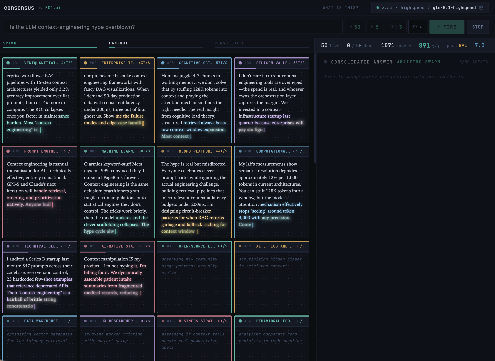

# consensus

> Ask not one, but N× agents.

Faster inference unlocks new paradigms beyond *chat*. **Consensus** is what we
get when we let one model hold many personas at once, then weigh their
opinions from different directions into a single synthesis.

A tech-demo by [E01.ai](https://e01.ai). Live: <https://e01.ai/consensus>.

BYOK (Bring Your Own Key). No backend. Runs entirely in the browser.



## How it works

1. **Spawn** — one streaming call generates N unique personas (`ROLE | angle`), tailored to your question.
2. **Fan-out** — batched requests at a chosen QPS; structured `<§N§>` markers route a single stream into per-agent panels.
3. **Consolidate** — final call merges every agent's take into `## TL;DR` · `## Synthesis` · `## Key takeaways`.

## Providers

| Provider     | Default model                                          | Get a key |
|--------------|--------------------------------------------------------|-----------|
| **z.ai**     | `glm-5.1-highspeed`, `glm-5.1`                         | [bigmodel.cn](https://open.bigmodel.cn) |
| **Fireworks**| `accounts/fireworks/routers/kimi-k2p6-turbo`           | [Fire Pass](https://app.fireworks.ai/fire-pass) |
| **OpenRouter**| `z-ai/glm-4.6` (or any model id)                      | [OpenRouter](https://openrouter.ai/keys) |
| **Custom**   | any OpenAI-compatible URL                              | — |

Per-provider keys persist independently in `localStorage` (key `swarm.state.v3`).
**No keys ship in the bundle.** Click the model button in the header to configure.

## Setup

```bash
npm install
npm run dev        # http://127.0.0.1:5173
```

## Build

```bash
npm run build      # → dist/  (relative-path bundle)
npm run preview    # serve dist/
npm run typecheck  # tsc --noEmit
```

Built bundle uses **relative asset paths** (`base: './'`) — drop `dist/` at the
root *or* a subdirectory (`/consensus/`, `/foo/bar/`) and it just works. The
live demo serves `dist/` under `/consensus/`.

## Tunable knobs (in-app, no rebuild)

| Chip      | Options                              | Default |
|-----------|--------------------------------------|---------|
| `N`       | 10 · 25 · 50 · 75 · 100  agents      | 50      |
| `B`       | 3 · 5 · 8 · 10  personas / request   | 5       |
| `QPS`     | 1 · 2 · 3 · 5 · 10  requests / sec    | 3       |

## Thinking-off knobs (per provider)

Each provider gets its own field shape to suppress chain-of-thought streams
(wired in `src/lib/providers.ts → disableThinkingParams`):

- **z.ai** — `thinking: { type: "disabled" }`
- **Fireworks** — `reasoning_effort: "low"`
- **OpenRouter** — `reasoning: { exclude: true, max_tokens: 0 }`

## Architecture

```
src/
  main.tsx                      entry
  App.tsx                       orchestrator + state
  hooks/
    useSwarm.ts                 spawn → fan-out → consolidate state machine
  lib/
    api.ts                      streamChat (SSE, retry, thinking-off injection)
    providers.ts                presets + endpoint normalization
    store.ts                    localStorage-backed user state
    prompts.ts                  spawn / batch / consolidate system prompts
    markdown.ts                 lite md → html + persona palette
    lang.ts                     CJK detect → reply language
    swarm-types.ts              shared types
  components/
    Header / QueryBar / InstrumentBar / SpawnBox /
    AgentGrid / AgentCard / Consolidator / ViewToggle / ProviderModal
  styles/
    globals.css                 design tokens (E01 palette)
    app.css                     layout
legacy/
  agent-swarm.html              original single-file prototype
```

## License

MIT. © E01.ai.
